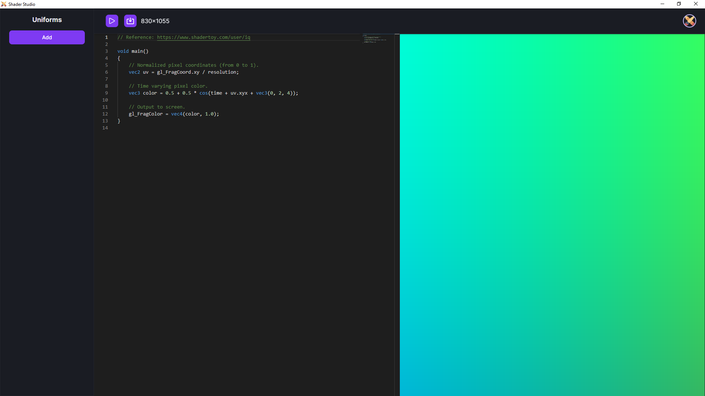

# Shader Studio

Shader Studio is a tool to create and experiment with fragment shaders.

<p align="center"></p>

Install.
```
cd shader-studio
npm install
```

Run.
```
cd shader-studio
npm start
```

Build.
```
cd shader-studio
npm run make
```